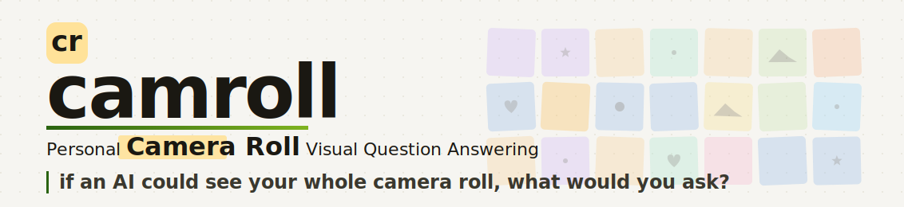

<p align="center">
  
</p>

<p align="center">
  <a href="https://arxiv.org/abs/XXXX.XXXXX"></a>
  <a href="https://thaoshibe.github.io/camroll/"></a>
  <a href="https://huggingface.co/datasets/thaoshibe/camroll-yfcc20"></a>
  <a href="https://huggingface.co/spaces/thaoshibe/camroll-agent"></a>
</p>

> **TL;DR:** `camroll-agent` is an **AI agent** that does VQA on a personal camera roll.
> 1. index your camera roll into a hierarchical queryable memory (events << captions << images).
> 2. the agent answers questions over that memory using 5 atomic tools: `search`, `grep`, `list_by_date`, `get`, and `view_image`.

---

## Install

<table>
<tr>
<th width="50%">🌐 Use API <sup>(OpenAI, Gemini)</sup></th>
<th width="50%">💻 Local <sup>(GPU required)</sup></th>
</tr>
<tr>
<td valign="top">

```bash
git clone https://github.com/thaoshibe/camroll
cd camroll/camroll-agent

conda create -n camroll python=3.10 -y
conda activate camroll

pip install -r requirements.txt
pip install -e .
```

OpenAI + Gemini APIs. No torch (~50 MB install).

</td>
<td valign="top">

```bash
git clone https://github.com/thaoshibe/camroll
cd camroll/camroll-agent

conda create -n camroll-local python=3.10 -y
conda activate camroll-local

pip install -r requirements_local.txt
pip install -e .
```

Adds Qwen-VL / Kimi-VL + `sentence-transformers`. Needs CUDA (~3 GB install).

</td>
</tr>
</table>

Set the API key for whichever cloud backend you use:

```bash
export OPENAI_API_KEY=sk-…       # for OpenAI VLM/LLM + embeddings (default)
export GEMINI_API_KEY=…           # for Gemini VLM/LLM
```

The default embedding model is **OpenAI's `text-embedding-3-small`** (fast,
no local install). If you'd rather use a local sentence-transformers model
(free, offline), install `requirements_local.txt` and pass
`--embedding-model sentence-transformers/all-MiniLM-L6-v2` at index time.

## Quickstart

### 1. Prepare a conversation JSON

```jsonc
// my_album.json
{
  "root_folder": "/absolute/path/to/photos",
  "profile_image": "profile.jpg",
  "library_description": "A 2005-2013 album from a college student.",
  "turns": [
    {"date": "2005-10-01", "user": {"image": "847410131.jpg"}},
    {"date": "2005-10-01", "user": {"image": "847410831.jpg"}},
    {"date": "2005-10-15", "user": {"image": "851200001.jpg"}}
  ]
}
```

Each turn has a `date` and a `user.image` path (absolute or relative to
`root_folder`). You can include extra fields on the turn — they'll be
passed to the VLM as additional context.

### 2. Build the memory (Stage 1 + Stage 2)

```bash
camroll-agent run my_album.json -o memory/
```

Or step by step:

```bash
camroll-agent build my_album.json -o memory/    # VLM captioning + event grouping
camroll-agent index memory/                     # SQLite + vector store
```

You can preview what would be processed without calling the VLM:

```bash
camroll-agent inspect my_album.json
```

### 3. Ask questions

```bash
camroll-agent ask "When did I go to Lake Michigan?" --memory memory/
```

For a streaming trace of thoughts + tool calls:

```bash
camroll-agent ask "..." --memory memory/ --stream
```

To let the agent actually look at photos with a VLM (for visual details
that captions miss):

```bash
camroll-agent ask "What color was the car at the airport?" \
    --memory memory/ --enable-view-image
```

## Python API

```python
from camroll_agent import build_memory, index, Agent

build_memory.run("my_album.json", output_dir="memory/", backend="openai")
index.run("memory/")

agent = Agent(memory_dir="memory/", llm_backend="openai")
result = agent.ask("When did I go to Lake Michigan?")
print(result.final_text)
print(result.tool_trace)
```

Streaming:

```python
for evt, data in agent.ask_streaming("..."):
    print(evt, data)
```

## The 5 atomic tools

The agent reasons over 5 deliberately small, single-purpose tools:

| Tool | What it does | Cost |
|---|---|---|
| `search(query, …)` | Semantic (vector) search over events + captions | cheap |
| `grep(query, …)` | Literal BM25 keyword search via SQLite FTS5 | cheap |
| `list_by_date(date_from, date_to, …)` | Pure metadata filter | cheap |
| `get(id)` | Fetch the full event or image record by id | cheap |
| `view_image(image_ids, prompt)` | Look at the actual photos with a VLM | expensive |

Every tool requires a one-sentence `thought` argument before it can be
called — this is the ReAct discipline. The agent terminates by emitting
plain text (no `answer` tool).

## Customizing

### Swap the LLM

Any class that implements `LLMClient.chat(messages, tools)` works:

```python
from camroll_agent.llm.base import LLMClient
from camroll_agent import Agent

class MyLLM(LLMClient):
    def chat(self, messages, tools=None, *, tool_choice="auto"):
        # return an OpenAI-shaped assistant message dict
        ...

agent = Agent(memory_dir="memory/", llm=MyLLM())
```

### Swap the VLM (for Stage 1 captioning and view_image)

```python
from camroll_agent.llm.base import VLMClient
from camroll_agent import build_memory

class MyVLM(VLMClient):
    def generate(self, prompt: str, image_paths: list[str]) -> str:
        ...

build_memory.run("my_album.json", output_dir="memory/", vlm=MyVLM())
```

### Swap embeddings

```python
from camroll_agent import index
from camroll_agent.vector import EmbeddingClient

class MyEmbed:
    def embed_many(self, texts: list[str]) -> list[list[float]]:
        ...

index.run("memory/", embedding_client=MyEmbed())
```

## Package layout

```
camroll-agent/
├── pyproject.toml
├── camroll_agent/
│   ├── __init__.py
│   ├── build_memory.py    Stage 1: VLM captioning + event grouping
│   ├── index.py           Stage 2: SQLite + FTS5 + vector store
│   ├── store.py             ↳ SQLite schema + read/write helpers
│   ├── vector.py            ↳ embeddings + FAISS / numpy
│   ├── agent.py           Stage 3: ReAct loop, pluggable backends
│   ├── tools.py             ↳ the 5 atomic tools
│   ├── prompts.py           ↳ system prompts + observation formatter
│   ├── schemas.py           ↳ OpenAI-style tool schemas
│   ├── cli.py             `camroll-agent inspect/build/index/run/ask`
│   └── llm/               pluggable VLM + LLM backends
│       ├── base.py
│       ├── openai_client.py
│       ├── gemini_client.py
│       └── local_client.py
└── examples/
    ├── sample_conversation.json
    └── quickstart.py
```

---

## Citation

If this code helps your research, please cite the camroll / kii paper(s).

## License

MIT.
