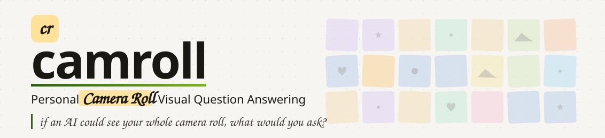

<p align="center">
  
</p>

<p align="center">
  <a href="https://arxiv.org/abs/2606.05275"></a>
  <a href="https://thaoshibe.github.io/camroll/"></a>
  <a href="https://huggingface.co/datasets/thaoshibe/camroll-yfcc20"></a>
  <a href="https://huggingface.co/spaces/thaoshibe/camroll-agent"></a>
  <a href="page/demo.html"></a>
</p>

> **TL;DR:** `camroll-agent` is an **AI agent** that does VQA on a personal camera roll.
> 1. index your camera roll into a hierarchical queryable memory (events << captions << images).
> 2. the agent answers questions over that memory using 5 atomic tools: `search`, `grep`, `list_by_date`, `get`, and `view_image`.

---

## 🤖 Run on your own photos with a coding agent

<details>
<summary><b>📋 Copy this prompt for your ClaudeCode/ Codex/ Cursors/ etc. !!!</b></summary>

```text
Hey, you need to set up "camroll" (https://github.com/thaoshibe/camroll), an AI agent
that does visual question answering over a personal camera roll. Set it up and run
it on MY photos. Ask me for anything you need, and show me every command you run.

1. Clone https://github.com/thaoshibe/camroll and install it:
     pip install -r requirements.txt
     pip install -e camroll-agent/
   (Use requirements_local.txt instead if I say I want to run fully local on a GPU.)

2. Ask me for:
     a) the absolute path to my photo folder, and
     b) which backend to use — openai (needs OPENAI_API_KEY), gemini (needs
        GEMINI_API_KEY), or local (needs a GPU, no key).
   Help me export the API key if needed.

3. Create a conversation JSON named my_album.json describing my camera roll:
     - "root_folder": my photo folder (image paths can then be relative to it).
     - "profile_image": one clear photo of me (ask me which, or pick a good one).
     - "library_description": a one-line description of the album.
     - "turns": one entry per photo, sorted by date, in this shape:
         {"date": "YYYY-MM-DD", "user": {"image": "<path>"}}
       Infer each photo's date from EXIF metadata; fall back to the filename or
       the file's modified time; use "unknown" only if there is no date at all.
   Then validate it (no API calls):
     python -m camroll_agent inspect my_album.json

4. Build + index the memory (replace <backend> with my choice):
     python -m camroll_agent run my_album.json -o memory/ --vlm-backend <backend>

5. Ask me what I want to know about my photos, then answer it:
     python -m camroll_agent ask "<my question>" --memory memory/ --llm-backend <backend>

Stop and confirm with me before anything that spends API credits or downloads
large models (e.g. the local Qwen-VL weights are ~15 GB).
```

</details>

---

## Install

<table>
<tr>
<th width="50%">🌐 Use API <sup>(OpenAI, Gemini)</sup></th>
<th width="50%">💻 Local <sup>(GPU required)</sup></th>
</tr>
<tr>
<td valign="top">

```bash
git clone https://github.com/thaoshibe/camroll
cd camroll

conda create -n camroll python=3.10 -y
conda activate camroll

pip install -r requirements.txt
pip install -e camroll-agent/
```

OpenAI + Gemini APIs. No torch (~50 MB install).

</td>
<td valign="top">

```bash
git clone https://github.com/thaoshibe/camroll
cd camroll

conda create -n camroll-local python=3.10 -y
conda activate camroll-local

pip install -r requirements_local.txt
pip install -e camroll-agent/
```

Adds Qwen-VL / Kimi-VL + `sentence-transformers`. Needs CUDA (~3 GB install).

</td>
</tr>
</table>

Set the API key for whichever cloud backend you use:

```bash
export OPENAI_API_KEY=sk-…       # for OpenAI VLM/LLM + embeddings (default)
export GEMINI_API_KEY=…           # for Gemini VLM/LLM
```

The default embedding model is **OpenAI's `text-embedding-3-small`** (fast,
no local install). If you'd rather use a local sentence-transformers model
(free, offline), install `requirements_local.txt` and pass
`--embedding-model sentence-transformers/all-MiniLM-L6-v2` at index time.

## Quickstart

All commands below assume you are at the **repo root** (`camroll/`).

### 1. Prepare a conversation JSON

```jsonc
// my_album.json
{
  "root_folder": "/absolute/path/to/photos",   // all image paths resolve relative to this
  "profile_image": "profile.jpg",              // reference photo of the person (used for identity context)
  "library_description": "This is my personal photo camera roll.",
  "turns": [
    {"date": "2005-10-01", "user": {"image": "847410131.jpg"}},
    {"date": "2005-10-01", "user": {"image": "847410831.jpg"}},
    {"date": "2005-10-15", "user": {"image": "851200001.jpg"}}
  ]
}
```

A ready-to-run sample (6 real photos) is at `camroll-agent/examples/sample_conversation.json`.

Preview what will be processed without calling any API:

```bash
python -m camroll_agent inspect camroll-agent/examples/sample_conversation.json
```

### 2. Build the memory (Stage 1 + Stage 2)

**Using OpenAI** (default):

```bash
export OPENAI_API_KEY=sk-…

python -m camroll_agent run camroll-agent/examples/sample_conversation.json -o memory/ \
    --vlm-backend openai \
    --vlm-model gpt-4o \
    --embedding-model text-embedding-3-small
```

**Using Gemini**:

```bash
export GEMINI_API_KEY=…

python -m camroll_agent run camroll-agent/examples/sample_conversation.json -o memory/ \
    --vlm-backend gemini \
    --vlm-model gemini-2.5-flash \
    --embedding-model text-embedding-3-small   # still needs OPENAI_API_KEY unless you use local embeddings
```

**Fully local — no API key needed (GPU required)**:

```bash
python -m camroll_agent run camroll-agent/examples/sample_conversation.json -o memory/ \
    --vlm-backend local \
    --vlm-model Qwen/Qwen2.5-VL-7B-Instruct \
    --embedding-model sentence-transformers/all-MiniLM-L6-v2
```

> First run downloads Qwen2.5-VL-7B from HuggingFace (~15 GB). Cached after that.

**All `run` flags:**

| Flag | Default | Description |
|---|---|---|
| `-o / --output-dir` | *(required)* | Where to write the memory |
| `--vlm-backend` | `openai` | `openai` \| `gemini` \| `local` |
| `--vlm-model` | backend default | e.g. `gpt-4o`, `gemini-2.5-flash`, `Qwen/Qwen2.5-VL-7B-Instruct` |
| `--embedding-model` | `text-embedding-3-small` | OpenAI model name or any `sentence-transformers` ID |
| `--max-images` | all | Process at most N images (useful for smoke tests) |
| `--resume` | off | Continue an interrupted run |

Or run Stage 1 and Stage 2 separately:

```bash
python -m camroll_agent build camroll-agent/examples/sample_conversation.json -o memory/  \
    --vlm-backend openai --vlm-model gpt-4o --max-images 10 --resume

python -m camroll_agent index memory/ \
    --embedding-model text-embedding-3-small
```

### 3. Ask questions

**Using OpenAI** (default):

```bash
export OPENAI_API_KEY=sk-…

python -m camroll_agent ask "When did I go to Lake Michigan?" \
    --memory memory/ \
    --llm-backend openai \
    --llm-model gpt-4o
```

**Using Gemini**:

```bash
export GEMINI_API_KEY=…

python -m camroll_agent ask "When did I go to Lake Michigan?" \
    --memory memory/ \
    --llm-backend gemini \
    --llm-model gemini-2.5-flash
```

**Fully local (no API key needed, GPU required)**:

```bash
python -m camroll_agent ask "When did I go to Lake Michigan?" \
    --memory memory/ \
    --llm-backend local \
    --llm-model Qwen/Qwen2.5-Coder-7B-Instruct
```

**All `ask` flags:**

| Flag | Default | Description |
|---|---|---|
| `--memory` | *(required)* | Memory directory built in Step 2 |
| `--llm-backend` | `openai` | `openai` \| `gemini` \| `local` (Qwen, GPU required) |
| `--llm-model` | backend default | e.g. `gpt-4o`, `gemini-2.5-flash`, `Qwen/Qwen2.5-Coder-7B-Instruct` |
| `--vlm-backend` | `openai` | VLM used by `view_image` (`openai` \| `gemini` \| `local`) |
| `--vlm-model` | backend default | e.g. `gpt-4o`, `gemini-2.5-flash`, `Qwen/Qwen2.5-VL-7B-Instruct` |
| `--no-stream` | off | Suppress live tool output, print final answer only |
| `--json` | off | Output full JSON (answer + tool trace + latency) |
| `--max-steps` | `25` | Max ReAct steps before stopping |
| `--max-view-image-calls` | `5` | Cap on expensive `view_image` calls |

Examples:

```bash
# use a different VLM for viewing photos (default: openai)
python -m camroll_agent ask "What color was the car at the airport?" \
    --memory memory/ --vlm-backend local

# get structured JSON output (answer + tool trace + latency)
python -m camroll_agent ask "When did I go to Lake Michigan?" \
    --memory memory/ --json

# suppress live output, print final answer only
python -m camroll_agent ask "When did I go to Lake Michigan?" \
    --memory memory/ --no-stream
```

## Dataset: `camroll-yfcc20`

The evaluation benchmark is on the Hub:
[**🤗 thaoshibe/camroll-yfcc20**](https://huggingface.co/datasets/thaoshibe/camroll-yfcc20).
It contains **20 personal camera rolls** (~15,600 photos) sampled from
[YFCC100M](https://multimediacommons.wordpress.com/yfcc100m-core-dataset/), each
with multiple-choice questions about the album owner and their events.

Each user folder is named by the owner's YFCC/Flickr id and contains:

```
<yfcc_user_id>/         # e.g. 10191539_N03
├── images.zip          # the camera roll (~500–1000 JPEGs), zipped
├── profile.jpg         # reference photo of the album owner
├── album_data.json     # semantic_qa + episodic_qa (multiple choice; option "a" is the answer)
└── metadata.csv        # per-image capture timestamp (image,datetaken)
```

**Download and unzip:**

```bash
pip install -U huggingface_hub
hf download thaoshibe/camroll-yfcc20 --repo-type dataset --local-dir camroll-yfcc20

cd camroll-yfcc20
for z in */images.zip; do (cd "$(dirname "$z")" && unzip -q images.zip); done
```

**Run the agent on one user** — build a conversation JSON from a user's
`images/` + `metadata.csv` (use `datetaken` as each photo's `date`), then:

```bash
python -m camroll_agent run camroll-yfcc20/10191539_N03/conversation.json -o memory/
python -m camroll_agent ask "What color is my hair?" --memory memory/
```

## Python API

```python
from camroll_agent import build_memory, index, Agent

build_memory.run("my_album.json", output_dir="memory/", backend="openai")
index.run("memory/")

agent = Agent(memory_dir="memory/", llm_backend="openai")
result = agent.ask("When did I go to Lake Michigan?")
print(result.final_text)
print(result.tool_trace)
```

Streaming:

```python
for evt, data in agent.ask_streaming("..."):
    print(evt, data)
```

## The 5 atomic tools

The agent reasons over 5 deliberately small, single-purpose tools:

| Tool | What it does | Cost |
|---|---|---|
| `search(query, …)` | Semantic (vector) search over events + captions | cheap |
| `grep(query, …)` | Literal BM25 keyword search via SQLite FTS5 | cheap |
| `list_by_date(date_from, date_to, …)` | Pure metadata filter | cheap |
| `get(id)` | Fetch the full event or image record by id | cheap |
| `view_image(image_ids, prompt)` | Look at the actual photos with a VLM | expensive |

Every tool requires a one-sentence `thought` argument before it can be
called — this is the ReAct discipline. The agent terminates by emitting
plain text (no `answer` tool).

## Customizing

### Swap the LLM

Any class that implements `LLMClient.chat(messages, tools)` works:

```python
from camroll_agent.llm.base import LLMClient
from camroll_agent import Agent

class MyLLM(LLMClient):
    def chat(self, messages, tools=None, *, tool_choice="auto"):
        # return an OpenAI-shaped assistant message dict
        ...

agent = Agent(memory_dir="memory/", llm=MyLLM())
```

### Swap the VLM (for Stage 1 captioning and view_image)

```python
from camroll_agent.llm.base import VLMClient
from camroll_agent import build_memory

class MyVLM(VLMClient):
    def generate(self, prompt: str, image_paths: list[str]) -> str:
        ...

build_memory.run("my_album.json", output_dir="memory/", vlm=MyVLM())
```

### Swap embeddings

```python
from camroll_agent import index
from camroll_agent.vector import EmbeddingClient

class MyEmbed:
    def embed_many(self, texts: list[str]) -> list[list[float]]:
        ...

index.run("memory/", embedding_client=MyEmbed())
```

## Package layout

```
camroll-agent/
├── pyproject.toml
├── camroll_agent/
│   ├── __init__.py
│   ├── build_memory.py    Stage 1: VLM captioning + event grouping
│   ├── index.py           Stage 2: SQLite + FTS5 + vector store
│   ├── store.py             ↳ SQLite schema + read/write helpers
│   ├── vector.py            ↳ embeddings + FAISS / numpy
│   ├── agent.py           Stage 3: ReAct loop, pluggable backends
│   ├── tools.py             ↳ the 5 atomic tools
│   ├── prompts.py           ↳ system prompts + observation formatter
│   ├── schemas.py           ↳ OpenAI-style tool schemas
│   ├── cli.py             `camroll-agent inspect/build/index/run/ask`
│   └── llm/               pluggable VLM + LLM backends
│       ├── base.py
│       ├── openai_client.py
│       ├── gemini_client.py
│       └── local_client.py
└── examples/
    ├── sample_conversation.json
    └── quickstart.py
```

---

## Citation

```bibtex
@misc{nguyen2026personalaiagentcamera,
      title={Personal AI Agent for Camera Roll VQA}, 
      author={Thao Nguyen and Krishna Kumar Singh and Donghyun Kim and Yong Jae Lee and Yuheng Li},
      year={2026},
      eprint={2606.05275},
      archivePrefix={arXiv},
      primaryClass={cs.CV},
      url={https://arxiv.org/abs/2606.05275}, 
}
```

## License

Attribution-NonCommercial-ShareAlike 4.0 International
